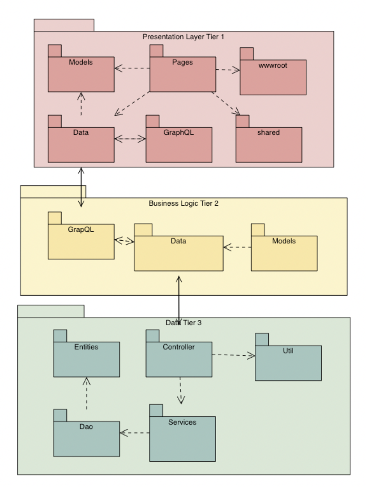
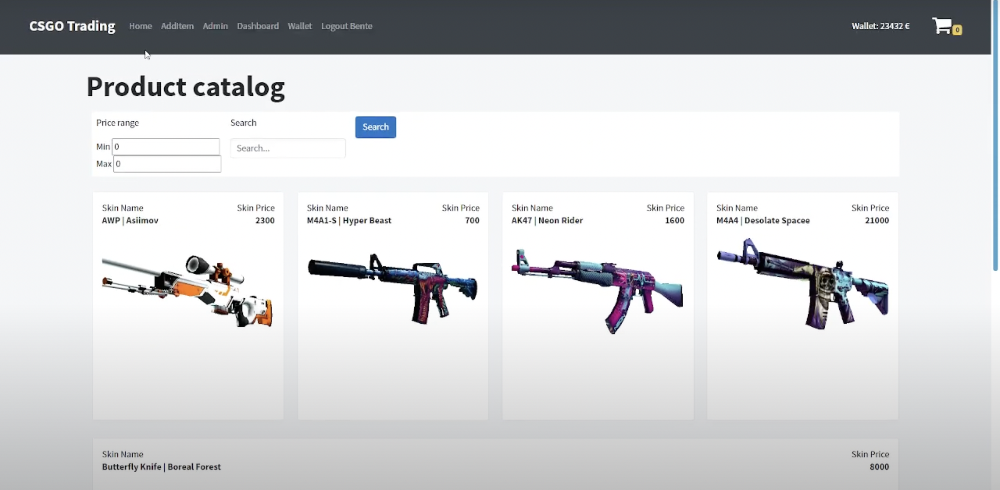

# CSGO-TRADING 
3-Tier distributed CSGO Trading system built with Blazor, C# ASP.NET Core + REST + GraphQL + Java Spring + Hot Chocolate + Strawberry Shake + Graph.ArgumentValidator + Blazored.Toast

# 3-Tier Application

- Presentation Tier (Tier 1)
https://github.com/Lennart1997/SEPCSTier1

- Application Tier (Tier 2)
https://github.com/AbdullahiIsse/SEP3-tier2 

- Data Tier (Tier 3)
https://github.com/AbdullahiIsse/SEP3-Tier-3 

# Video

 
